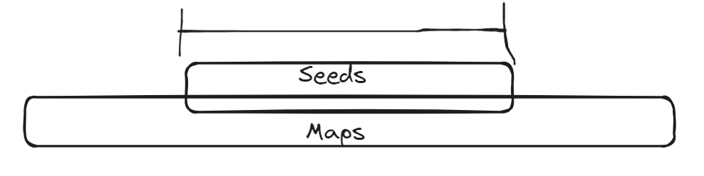
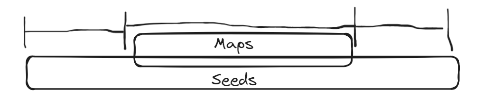
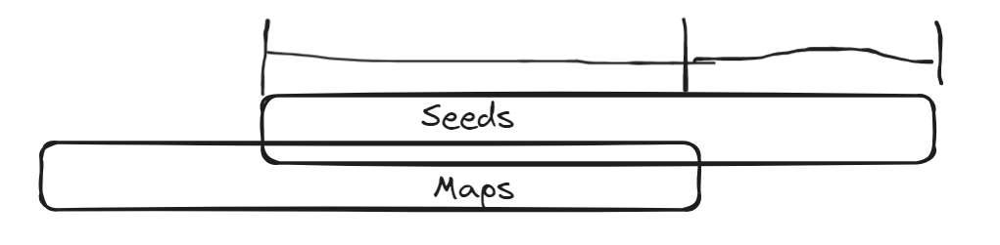
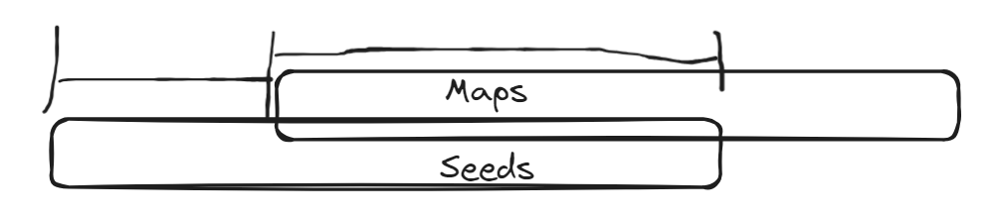

  
# This is my first attempt at the advent of code.

## A little backstory first

I studied a little programming and computer science back in the last year of high school, and it did not stick with me. Some of the stuff I did back then was fun, but I never pursued a career in the field. Fast forward... what? fifteen years or something, and that little dream I had back then of being a game developer suddenly came back to me. Maybe it's the popularization of AI tools, allowing people to create projects that are so interesting and fun, or the influx of game development and coding-related YouTubers I came across recently, or even my less than great job situation right now. Whatever it was, I decided to spend the holidays, and probably a huge amount of time after that, learning to code.

So I armed myself with the CS 50 Python lectures and just started going for it. But Google (knowing everything about my life as usual) started recommending more and more videos about coding, and one of them (I can't quite remember which one) featuring a bald guy with a big beard and heavy accent (no clue from where) using some weird editor (neovim) talking about day 1 and explaining the idea of Advent of Code.

So with a **lot of optimism** (way more than I realized), I paused the CS50 Python course on day 3 (lol) and set to go as far as I possibly could on **Advent of Code 2023**.

## Spoilers for some of the solutions of AoC 2023

---  
## Day 1:   

### Part 1:  
So the idea of Part 1 is quite simple. You have a big document containing some lines; each line has a ton of letters and some numbers. Get the first and last number of each line, concatenate each one, and add the result from each line.

After looking up how to open a document in Python and finding `isdigit()` in the documentation, I was able to do it no problem. It took me about 30 minutes.

### Part2:  
In part two, numbers still count even if they are spelled out ('one', 'two', etc...). And this was my first real road block. There are a couple of pretty simple solutions here, but I got tunnel vision on one terrible idea I had no clue how to use.

Basically, my first idea was to use `find()`, but that would return an index, so I had to save the index and the string related to that, meaning I had to create a huge monstrosity of an `if statement`, and God only knows how I would have to change the first part of the program to work this way now.I actually spent 2 days—about 4 hours in total—banging my head to figure out how to do this, and every step I took only made things worse. 

So... I cheated... kinda... I asked a friend for help. He has more experience programming and a  year or so of Python under his belt, and he mentioned replacing the words. So `one` would become `1`. I am not going to lie; I felt like a god-damned smooth brain for not thinking it myself.

After picking my morale from the ground and googling `how to repalce a string in Python` I was ready to finish this part. Just a quick `str.replace()` and I could even pass the result of that to the function from Part 1, easy peasy. I ran the example, and... it's not working. 

Welp, about an hour later and way more `print()` than I would like to admit, I finally found the issue. Some words overlap, so `eightwo`, for example, should result in 82, but if my code had the`replace("two", 2)` before the `replace("eight", 8)`, the str would become `eigh2` and the `replace("eight", 8)` would not trigger, giving me a lot of inconsistent results. I even tried to place each `replace()` in some order that would not cause issues, but I could not find one.

What's the solution? It's very simple (it took me an hour and a half to think of it). When replacing the letters, keep the first and last letter. So `one` becomes `o1e`, `two` becomes `t2o` and so on. And even though this feels like the most caveman way to do it, it works wonders.

#### Day 1 Conquered

## Day 2:

### Part 1:  
Cubes, cubes, and more cubes. Get some numbers of cubes, check if said number is below a maximum amount, and you are done. Pretty simple. It took me a little while to figure out how to count each color, but I got it in the end. A simple `match:` on the first letter of each word to determine the color, add them together, and check if they are below the maximum. It took me around 40 minutes.

### Part 2:  
Even moooore cubes. Instead of checking for an max value, now we just do a simple sorting to hold the highest value of each color in each game and multiply all of it together. Probably the easiest part of all.

#### Day 2 Conquered

## Day 3:

### Part 1:  
I remember having a lot of trouble with this one, and by god, looking at my code now, I can see that I had some issues. The idea of checking "in two dimensions," basically checking around a symbol, was quite easy to understand logically, but to figure out every detail of the code was very challenging. This one took me around 4 or 5 hours, if I recall correctly, that being a whole week of coding after work pretty much. The idea is: look for a symbol that is not `.` or `/n`, and when one is found, get its index. Now check `+1` and `-1` on the same line, and `-1`,`0`, and `+1` on both the top and bottom lines for numbers, and if there are any numbers there, add them to a list. Easy

**BUT** there is a problem, and that is ignoring all the details of what I already said (I am pretty sure I did nor need all those `for` loops), how do I actually check if there are numbers in the positions I mentioned? I could check if there is any number, and if there is, I could check if there are numbers in front and behind and build the number like that. I could, yes, if I got it to work. I am still not sure why, but it did not work at all, and after enough days went by, I knew I needed a new approach.

So what did I do? I just checked the hole line and saved the position of every number, and then I saved the index around every symbol so I could just compare them, and if there was anything, I saved that number. It is a little more strange than that. I save the full list of symbols, and after that, I go back to the lines, and when a number is found, I check it against the symbol index to see if that number matches; if yes, that number is saved to a `bufferList`, and if not, it's discarded. Basically, I check each full line again for each new symbol, which is probably not efficient, but by god, that was the only thing that came to me at the moment. After all the lines are checked for each symbol, they are added to the result. It is not super efficient, but it works.

### Part 2:  
Apparently, my not-so-efficient way to do Part 1 somewhat paid off in Part 2. Now there are some symbols that, when in contact with exactly two parts, have their value multiplied instead of added. So in the part where I check the indexes, all I had to do was put a `adjacentPart` counter that ticks up when a part is added to the `bufferList`, and if that count was on 2, instead of adding those two parts, it would add the result of multiplying those two. After such a hard part 1, it was very nice to have a part 2 that simple. (Oh, how would I miss easy parts like this.)

#### Day 3 Conquered

## Day 4:

### Part 1:  
There are two columns of numbers, and we need to check how many times they match, and that number becomes a power of two, and you add that to the results. It's actually super simple. Make two lists, check every item in the second list against each item in the first, add the numbers of times they match with a simple `winningNum == currentNum`, and just do the power of two calculation. I mostly struggle with this one with "cleaning" the input in each list. Things like `split()` and `strip()` were giving me different results than expected, so really going through how they work and when to use them on the input was pretty interesting.

### Part 2:  
How many OOM errors do you think I got? 

This one was very complicated for me. Was the first one where I did not have a plan right away. Basically, instead of giving points, each card multiplies the one that comes after it, so 2 points in `card 1` get you, one `card 2` and one `card 3`, and since `card 2` gives you, lets say, 1 point also, now you have another `card 3`, but don't forget that `card 2` was duplicated, so it gives you 2 `card 3`, and so on. That put my brain in a twist, and I spent around 2 hours just thinking about it. No coding or anything, just cooking the problem in my mind. And eventually I got a solution—not a great one, but a solution nonetheless.

I originally planned on making a list of the original cards and another list of lists, that list containing `[CARD ID, POINTS]`, for each card in the list, and using the `CARD ID` as an index to add the correct new card. I would also need an index to know which card I was checking at any moment, since I would be updating the list as I went through it (just remembering it makes me confused).

So looking at how to have more control over the lists, I found out about `Queues`, and it made this part a lot easier. The idea was mostly the same, but now I could add things to the `Queue` knowing I would not mess up the order or generate an infinite loop (given the rest of my code would work as intended). So now, check `card 1`, `put()` the correct card in the `Queue` based on the number of matches, repeat until you get to the copies, and keep repeating until finished. 

One or two more OOM errors... realize you can just `ans += 1` every time you `put()` instead of adding cards to another list to count later, run your code for 10 minutes, and you are done. Easy peasy, I guess.

Well, I was happy with the fact that the code gave me the right answer, but the happiness lasted less than the run time of my program. After getting it right, I looked online to see if anyone was having a similar issue as me. I remember in the Day 3 video from ThePrimeagen, someone mentioning Day 4 taking some time, so maybe this was the right way to do it.

So I ended up on the Reddit of AoC Day 4 Part 2, and the first post was a meme about how long it took to run. The first and second comments were something on the lines of "You know you don't actually need to create copies, right?" and "How does that take longer than 100 ms?" and, as ashamed as I am to admit, that made me **MAD**. So I went back to my code and banged my head against it until I figured out how to make it work faster... and it was pretty easy, actually.

The way I explain the problem in the beginning gives it away. `card 1` creates another `card 2`. You don't need to count the points in `card 2` again; you just multiply its result by 2. So when it generates a `card 3`, it makes 2 of them. So now with 3 `card 3`, you don't run the whole code on it three times; you run it once and multiply the result by 3. You just need a list that holds the multiplier of each card. 

A list that starts `[1,1,1]`, and as the points mount up, those numbers go up and get multiplied by the correct card. So in the example, after `card 1`, the list becomes '[1, 2, 2]', and after `card 2`, '[1, 2, 3]', and so on. It took me some time to figure out how to multiply the correct card by the correct number of times, but it was mostly just me battling with the indentation of the functions in Python. After that, the code was flying.
#### Day 4 Conquered

## Day 5:

### Part 1:  
Very similar to the previous day. There is a lot to check and compare, and just doing it is not very efficient. Even if it's not efficient, I actually started by just checking all the numbers. I was not sure how the function was supposed to work exactly, and trying to figure that out and be efficient was really making my head hurt.

So I just did the `seed = fertilizer`, `fertilizer == water`,  and so on. It was not hard, but it took a while. Mostly just trying to separate the coordinates of each stage correctly and making a loop where the function would feed itself. A lot of debugging in this one. Eventually I got the example to work again: just check if the numbers are the same and modify it by the correct value. After the working example, I ran it on the actual input and, well...

Let's just say that I finished a better implementation of the code faster than the code took to run, so I don't actually know how long it would take (at least 4 hours, probably way more). Credit goes to a friend of mine (@alissonfpmorais) who came up with the idea I used in this one. It's one of those things that, after hearing it, I felt really dumb for not realizing. Basically, you can check if a number is within a range, and if it is, you just alter its value. 

So you don't need to check `if 79 == 77`, `if 79 == 78`, `if 79 == 79`, just checking hundreds of thousands, if not millions of numbers. You just check if 79 is between the start and end of range, `if 50 <= 79 <= 50000`. This way, you just check **once** per seed instead of millions of times. And since the way to change the number is fixed by range, you can just add or subtract the correct value. After changing that, it worked, and took no time at all.

### Part 2:  
So if the last implementation would have taken forever before, now it takes forever an infinite number of times. The number of seeds now are represent by ranges of **HUNDREDS OF MILLIONS**. So even if the first part was fast, it would never finish this part. Basically, I knew what to do but could never do it. 

The idea is the same, but instead of checking for a single number, I must check for ranges to overlap. There are a couple ways for two ranges to overlap:

`seedRange` is entirely inside `mapRange`; when this happens, you can just translate the start and end of `seedRange` to its new values.

`mapRange` is entirely inside `seedRange`: this creates 3 new ranges;
`seedRange`  -> start of `mapRange` -1
the full `mapRange` converted to the correct value
and the end of `mapRange` + 1 -> the end of `seedRange`

`seedRange` starts in `mapRange` but ends out: this creates 2 new ranges;
start of `seedRange` converted -> end of `mapRange` converted
end of `mapRange` + 1 -> end of `seedRange`

`mapRange` starts in `seedRange` but ends out: This creates two new ranges;
start of `seedRange` -> start of `mapRange` -1
start of `mapRange` converted - > end of `seedRange` converted

`seedRange` and `mapRange` do not overlap; the `seedRange` remains the same.

I believe this logic is correct, but I have implemented it a couple different times now, and it never works on the main input. Maybe it's some small mistake in logic where I end and start ranges on the wrong position, or maybe it's a mistake in the written code that causes this issue, or even that my logic is completely wrong (I sure hope not). 

Whatever it is, I have to throw the towel for now. The two-week holiday break I get at work has come and gone; the focus has switched from work to family and friends and back to work again; and more and more days where I just hit my head against this wall just pass by. I will come back to it some time later. But for now, I believe it will be better to stop for a moment and come back to the course I was taking.

### Day 5 persists

Even though I gave up a little earlier than I thought I would, this was very fun and very educational. I learned a lot, not only about the basics of Python but also how to think more like a programmer, and even some Git basics as well. And looking back, I can say that I would not have learned this much if I had not participated.